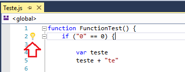
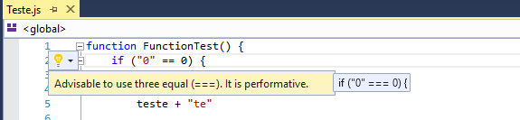
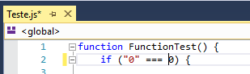
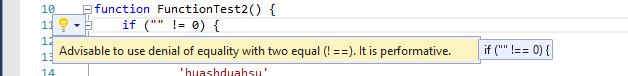
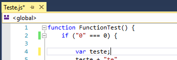

# Js Advice - Thinking JavaScript as Ninja

Download this extension from the [VS Gallery](https://visualstudiogallery.msdn.microsoft.com/fdb40cc5-7e22-4d35-9b07-ce7e5aee3a46?SRC=VSIDE)
or get the [CI build](http://vsixgallery.com/extension/8e5bc658-1ed9-4839-939b-204b758063a6/).

---------------------------------------

 

Js Advice is a JavaScript code analyzer. Checking possible errors or bad practices will advise possible changes, in JavaScript code. By Light bulb (Visual Studio 2015) and intuitive menu.

See the [changelog](CHANGELOG.md) for changes and roadmap.

## Features

- Using the Light Bulb Visual Studio 2015.
- Code fixed to Equals Operators
- Code fixed to Unequal Operators
- Code fixed to include Semicolon in end the command

### Light Bulb Visual Studio 2015:
Using the Light Bulb Visual Studio 2015:

### Equals Operators:
In code that equality comparison is with two equal (==), then will be shown an improvement (press 'ctrl + .' or click in light bulb), to use three equal (===). Indicating how it will look the result.  

Pressing enter or clicking on the suggestion, will apply.

### Unequal Operators
When writing an unequal code '! =', It will be suggested to use '! ==' (press 'ctrl + .' or click in light bulb).

Suggestion apply:

### Include Semicolon in end the command
When writing code that has no semicolon (;) at the end of the command will be suggested place.

Suggestion apply:

## Contribute
Check out the [contribution guidelines](CONTRIBUTING.md)
if you want to contribute to this project.

For cloning and building this project yourself, make sure
to install the
[Extensibility Tools 2015](https://visualstudiogallery.msdn.microsoft.com/ab39a092-1343-46e2-b0f1-6a3f91155aa6)
extension for Visual Studio which enables some features
used by this project.

## License
[Apache 2.0](LICENSE)

[Informações sobre Licença Software](http://pt.stackoverflow.com/questions/76093/aplicar-licen%C3%A7as-ao-github)

[Legislação Software BR](http://www.inpi.gov.br/menu-servicos/programa-de-computador/legislacao-programa-de-computador)
